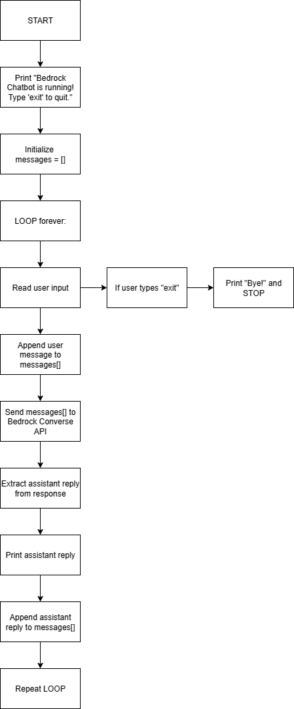
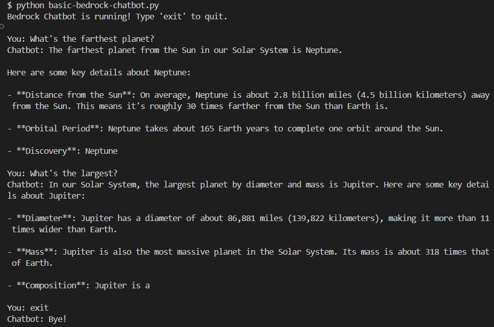

# Build a Simple Chatbot with Amazon Bedrock’s Converse API + Python

---

## About this project

This project is a simple terminal-based chatbot built with Python, boto3, and Amazon Bedrock’s Converse API. It allows you to type messages in your terminal, get responses from a Bedrock foundation model, and continue chatting until you type `exit`.

---

## Why this project is important

If you’re learning Amazon Bedrock, it’s easy to stop at “one prompt → one response.”

This project is important because it demonstrates the next real step:

✅ Building an actual conversation loop by storing message history and sending it back to the model each time.

It shows the core concept behind real chat apps:

- user sends message
- assistant responds
- conversation history is preserved
- the model responds with context

---

## Logic Flow



---

## Quick Start

#### 1) AWS Credentials

Configure your AWS credentials using:
```bash 
aws configure sso
# or 
aws configure
```

To confirm you're authenticated:

`aws sts get-caller-identity`

#### 2) Create a virtual environment (recommended)
```bash
python -m venv venv
```

Activate it:
```bash
# Windows (Git Bash)
source venv/Scripts/activate

# macOS/Linux
source venv/bin/activate

# Windows (Command Prompt)
venv\Scripts\activate         
```

#### 3) Install boto3
```bash
pip install boto3
```

### Run the script
```bash
python basic-bedrock-chatbot.py
```
You should see:

`Bedrock Chatbot is running! Type 'exit' to quit.`

---

## Code explanation

#### Create the Bedrock Runtime client + choose a model
```python
import boto3

client = boto3.client("bedrock-runtime", region_name="us-east-1")
model_id = "amazon.nova-micro-v1:0"
```

- bedrock-runtime is the service used to run inference (call models)
- region_name must match a region where Bedrock is available for your account
- model_id selects which Bedrock model your chatbot will use

#### Initialize the conversation history list
```python
messages = []
```

This list stores the entire conversation in the format Bedrock expects:

- user messages
- assistant messages

This is what makes it a chatbot instead of a single prompt script.

#### Keep chatting until the user types exit
```python
while True:
    user_input = input("You: ")

    if user_input.lower() == "exit":
        print("Chatbot: Bye!")
        break
```

- `while True` keeps the program running
- typing `exit` ends the chatbot cleanly

#### Add the user message to chat history
```python
messages.append(
    {
        "role": "user",
        "content": [{"text": user_input}],
    }
)
```

This appends a message in the exact structure required by `converse()`.

#### Call the Converse API
```python
response = client.converse(
    modelId=model_id,
    messages=messages,
    inferenceConfig={"maxTokens": 100, "temperature": 0.7},
)
```

This sends the full conversation to Bedrock.
- `maxTokens`: limits how long the reply can be
- `temperature`: controls randomness/creativity in the response

#### Extract the assistant response and print it
```python
bot_reply = response["output"]["message"]["content"][0]["text"]

print(f"Chatbot: {bot_reply}\n")
```

This pulls the assistant reply out of the Bedrock response object and prints it to the terminal.

#### Add the assistant reply back into chat history
```python
messages.append(
    {
        "role": "assistant",
        "content": [{"text": bot_reply}],
    }
)
```

This is the key step that gives the model conversation memory. Each time you send a new message, Bedrock receives the full history again.

---

## Terminal output demo screenshot



You’ll notice some replies get cut off at the end. That happens because the chatbot limits how long the model is allowed to respond:
```python
inferenceConfig={"maxTokens": 100, "temperature": 0.7}
```

`maxTokens` sets the maximum size of each reply. If the model starts generating a longer answer (like a list of bullet points), it can hit the limit and stop mid-sentence, which is why you see lines like:
- “Neptune …”
- “Jupiter is a …”

It’s not an error. It just means the response hit the token limit.

---

## YouTube Tutorial

📺 Watch the full walkthrough on YouTube: [Build a Simple Chatbot with Converse API + Python](https://youtu.be/M882yjnGtNU)

In the video, I explain:
- how the chatbot loop works
- how `messages = []` stores chat history
- why sending the full `messages` list into `converse()` creates “memory”
- how the `exit` command ends the session

---
